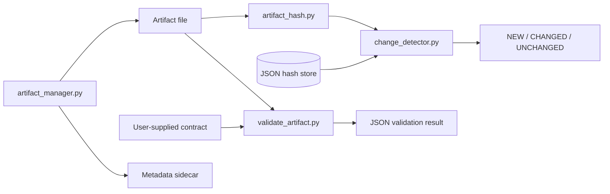

# AgentForge

**Small, inspectable tools for artifact validation and change-aware automation.**

AgentForge provides Python command-line utilities to hash files, check lightweight data contracts, manage text artifacts and metadata, and distinguish new inputs from changed or unchanged ones. Use the pieces in your own agent or batch workflow without adopting an orchestration framework.

[Quickstart](#quickstart) · [How it fits together](#how-it-fits-together) · [Source map](#source-map) · [Limitations](#limitations)

## What is included

| Tool | Purpose |
| --- | --- |
| File hashing | Chunked hashing with SHA-256 by default |
| Contract checks | Required JSON fields and basic types; CSV columns and row bounds; text rules |
| Change store | A JSON-backed comparison returning `NEW`, `CHANGED`, or `UNCHANGED` |
| Artifact management | Write, read, and list files; writes include a `.meta.json` sidecar |
| Monitor example | A host-specific example of comparing a source hash with persisted state |

## How it fits together



These are separate utilities, not an automatically connected agent execution graph. Your calling process decides when to validate, persist a new hash, or trigger work.

## Quickstart

Use Python 3 and Git. The utilities import only the Python standard library; there is no dependency-install step.

```bash
git clone https://github.com/MdSadman20040812/AgentForge.git
cd AgentForge
python src/artifact_hash.py final_analysis_report.md
python src/artifact_manager.py list --dir src
python src/validate_artifact.py --help
python src/change_detector.py --help
```

The hash command prints an algorithm-prefixed digest; the manager prints JSON. For validation, supply your own contract to `--schema` and the target file to `--artifact`. Use `--schema-type csv` explicitly for a CSV artifact with a JSON-formatted CSV contract; automatic detection uses the **schema file's extension**, not the artifact's.

| Contract type | Implemented checks |
| --- | --- |
| JSON | Required keys, basic type names, nested objects, and limited enum/array checks |
| CSV | `required_columns`, `min_rows`, `max_rows` |
| Text | `MIN_LINES`, `MAX_LINES`, `MUST_CONTAIN`, `MUST_NOT_CONTAIN`, `REGEX`, `MIN_SIZE`, `MAX_SIZE` |

`change_detector.py` defaults to comparison only. Persist a value with `--action store`; provide the same `--store`, `--key`, and `--hash` arguments when comparing it later.

### Before using the monitor example

[monitor_demo.py](src/monitor_demo.py) contains author-machine paths for `ARTIFACT_HASH_STORE`, `TRIGGER_SOURCE`, and the hashing subprocess. Review and adapt those paths before running it. The unchanged branch currently prints a blank line, while new and changed branches print a message; **all three exit with code 0**. It does not launch an agent or install a cron job.

## Source map

| File | Start here for |
| --- | --- |
| [src/validate_artifact.py](src/validate_artifact.py) | Contract format and validation CLI |
| [src/artifact_hash.py](src/artifact_hash.py) | File digests and optional digest output file |
| [src/change_detector.py](src/change_detector.py) | Persisted hash comparison |
| [src/artifact_manager.py](src/artifact_manager.py) | Artifact I/O and metadata |
| [src/monitor_demo.py](src/monitor_demo.py) | Host-specific monitoring example |
| [SYSTEM_VERIFIED.md](SYSTEM_VERIFIED.md) | Historical verification notes, not a fresh test report |
| [final_analysis_report.md](final_analysis_report.md) | Committed sample artifact |
| [result_method_a.csv](result_method_a.csv), [result_method_b.csv](result_method_b.csv), [result_method_c.csv](result_method_c.csv) | Committed CSV examples |

## Limitations

- This repository does not include an agent runtime, parallel-worker dispatcher, retry controller, or scheduler.
- The JSON validator is a small custom contract checker, not a complete JSON Schema implementation. CSV row bounds count physical lines, which can miscount quoted multiline records.
- A matching hash proves byte identity, not correctness. Passing a contract does not establish scientific or semantic validity.
- Hash-store writes have no locking or atomic-update mechanism; coordinate concurrent writers externally.
- The monitor does not check its hashing subprocess's return code. A failed hash operation can therefore become an empty stored value.
- This documentation refresh inspected source; it did not reproduce the historical verification claims. No license file is present in the inspected repository tree.

## Contribute

Open an issue or pull request with a minimal input, the expected contract result, and the actual result. Useful next steps include portable monitor configuration, subprocess error handling, atomic state updates, and regression tests for malformed and multiline artifacts.
