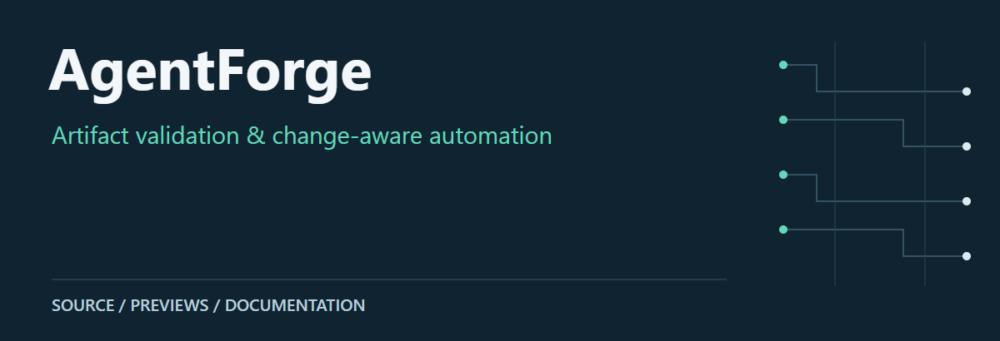
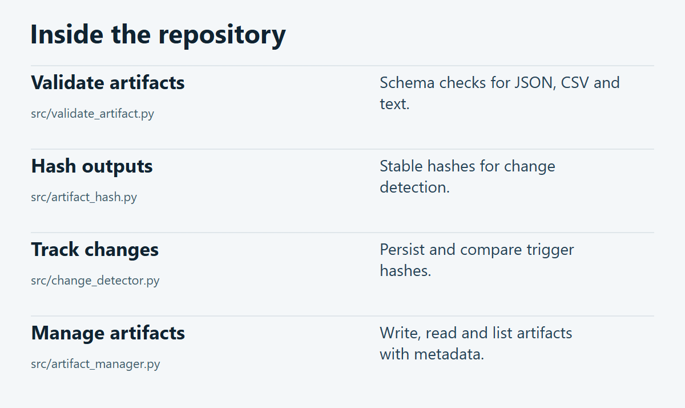

# AgentForge

Python utilities for validating artifacts, hashing outputs and detecting changes. The repository contains small automation building blocks and a worked example—not an installable multi-agent SDK.

**[Source guide](#source-guide)** · **[Getting started](#getting-started)** · **[Scope & limitations](#scope--limitations)**

## Source guide

[](docs/visuals/repository-guide.png)

| Component | Open source | Purpose |
| :-- | :-- | :-- |
| Validate artifacts | [`src/validate_artifact.py`](src/validate_artifact.py) | Schema checks for JSON, CSV and text. |
| Hash outputs | [`src/artifact_hash.py`](src/artifact_hash.py) | Stable hashes for change detection. |
| Track changes | [`src/change_detector.py`](src/change_detector.py) | Persist and compare trigger hashes. |
| Manage artifacts | [`src/artifact_manager.py`](src/artifact_manager.py) | Write, read and list artifacts with metadata. |

## Getting started

From a local checkout of this repository:

```bash
python src/artifact_hash.py README.md
python src/validate_artifact.py --help
```

## Scope & limitations

The monitor demo uses machine-specific paths. Adapt those before running it. See [system notes](SYSTEM_VERIFIED.md) for the original integration context.

---

[Visual asset sources and presentation notes](docs/visuals/README.md)
