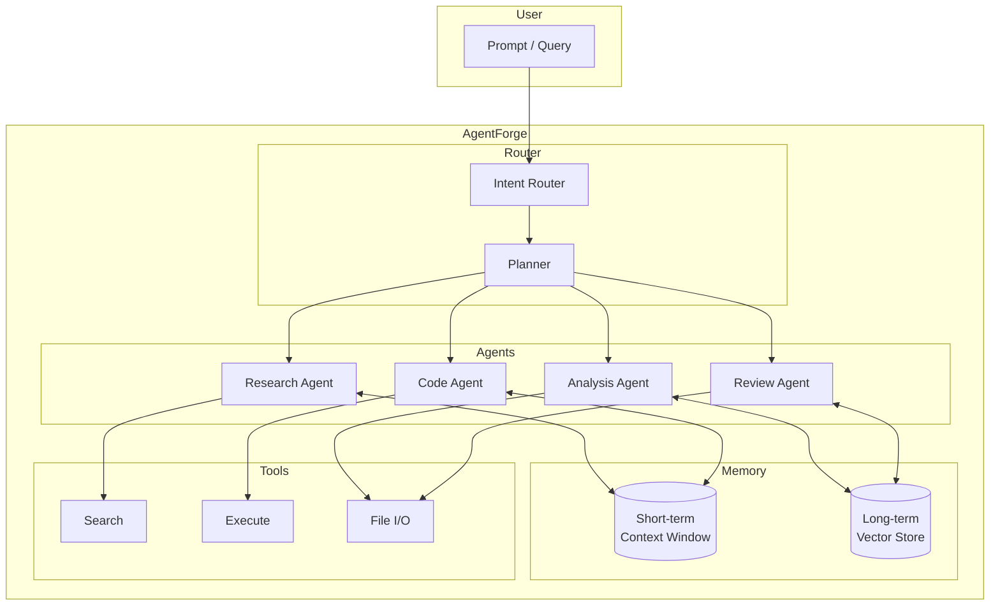

**Multi-agent orchestration framework — compose, route, and coordinate LLM agents.**

---

## 🏗️ Architecture



---

## ✨ Features

- **Intent routing** — automatic agent selection based on task type
- **Multi-step planning** — decompose complex queries into agent pipelines
- **Tool use** — search, code execution, file operations
- **Memory tiers** — short-term context + long-term vector retrieval
- **Agent coordination** — review agent validates outputs before return

---

## 🚀 Quick Start

```bash
pip install agentforge
from agentforge import Forge
forge = Forge()
response = forge.run("Research X, code solution Y, analyze Z")
```

---

## 📁 Project Structure

```
AgentForge/
├── agentforge/
│   ├── core.py            # Forge orchestrator
│   ├── router.py          # Intent routing
│   ├── planner.py         # Multi-step decomposition
│   ├── agents/            # Agent implementations
│   ├── memory/            # Short + long-term memory
│   └── tools/             # Tool integrations
├── tests/
└── README.md
```

---

## 📄 License

MIT © Md Sadman Bin Masud
